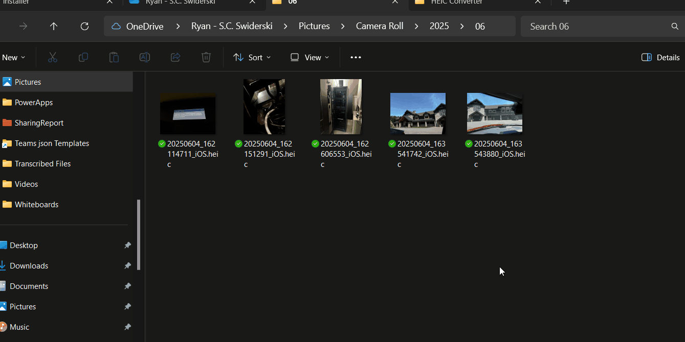

# HEIC Converter - User Guide

## Quick Start: Convert HEIC Photos to JPEG

HEIC Converter adds a simple right-click option to convert your iPhone photos (HEIC files) to JPEG format that works with all apps and devices.

### How to Convert Photos

1. **Locate your HEIC photos** in Windows File Explorer
2. **Right-click** on one or more HEIC files
3. **Select "Convert to JPEG"** from the context menu
4. **Wait a moment** - the JPEG files will appear in the same folder

### Important Notes

- ✅ **You can select up to 15 HEIC files at once** for batch conversion
- ✅ **JPEG files are created alongside the originals** - your HEIC files are not deleted
- ✅ **High quality conversion** - JPEG files maintain excellent image quality (95% quality setting)
- ✅ **No console windows** - conversions happen silently in the background

### File Selection Tips

**Single File:**
- Right-click any `.heic` file → "Convert to JPEG"

**Multiple Files (up to 15):**
- Hold `Ctrl` and click each HEIC file you want to convert
- Right-click on the selection → "Convert to JPEG"
- All selected files will be converted

### What Happens During Conversion

1. Each HEIC file is opened and processed
2. A new JPEG file is created with the same name but `.jpg` extension
3. The conversion happens silently - no windows or messages appear
4. You'll see the new JPEG files appear in the same folder

### Example

If you have a file called `IMG_1234.heic`, after conversion you'll have:
- `IMG_1234.heic` (original file - unchanged)
- `IMG_1234.jpg` (new JPEG file)

### Troubleshooting

**Nothing happens when I right-click:**
- Make sure you're right-clicking on `.heic` files
- Restart Windows Explorer if needed

**I need to convert more than 15 files:**
- See the [README.md](README.md) for command-line usage that can handle unlimited files with wildcards like `heiccv *.heic`.
- Or select files in groups of 15 or fewer

**The context menu option doesn't appear:**
- Make sure HEIC Converter is properly installed
- Try restarting your computer

---

